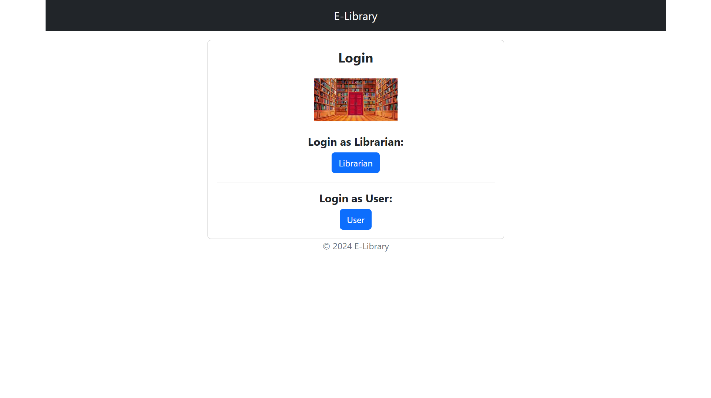
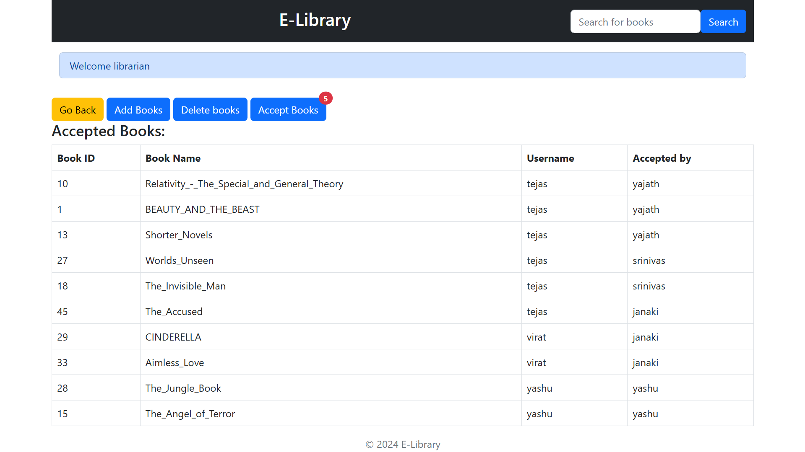
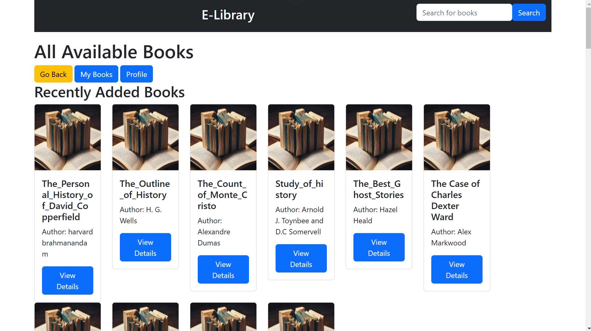
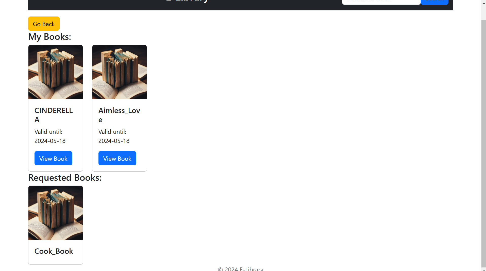
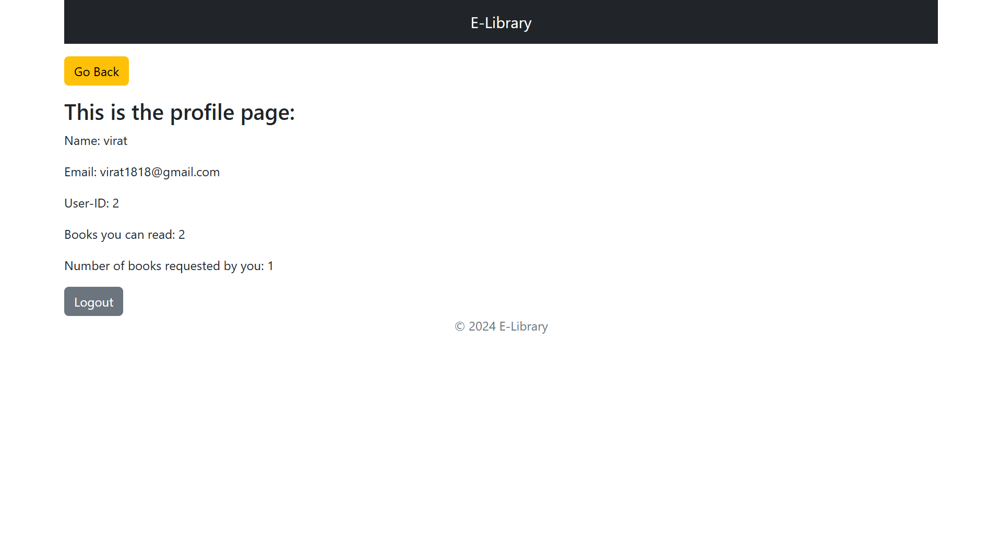

# E-Library 

The E-Library project is a platform designed to manage books, allowing for functions like adding, deleting, revoking access, and ensuring timely returns of books. It is structured into five main modules:

Librarian: Manages books, users, and sections.
User: Handles user interactions like borrowing and returning books.
Books: Contains the book management system.
Section: Manages different categories or sections for books.
Intro: Provides the introductory or landing page logic.
Each module consists of four key Python files:

init: Initializes objects for the module.
Models: Defines the database tables and relationships.
Forms: Contains form input validations.
Views: Manages routes and logic for the pages.


## Tech Stack

**Client:** \
• HTML5 \
• CSS3 \
• Bootstrap

**Server:** \
• Flask \
• Flask-WTF \
• Flask_SQLAlchemy \
• Flask_Migrate \
• Werkzeug \
• Jinja2

**Database:** \
• SQLite

**Package Management:** \
• pip \
• requirements.txt

**Development Tools:** \
• Pycharm \
• SQLite


## Features

- Light/dark mode toggle
- Live previews
- Fullscreen mode
- Cross platform


## Run Locally

Clone the project

```bash
  git clone https://github.com/yajath003/E-Library.git
```

Go to the project directory

```bash
  cd E-Library
```

Install dependencies

```bash
  pip install -r requirements.txt
```

Start the server

```bash
  python main.py
```


## Screenshots














